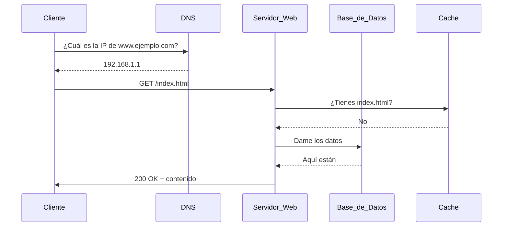
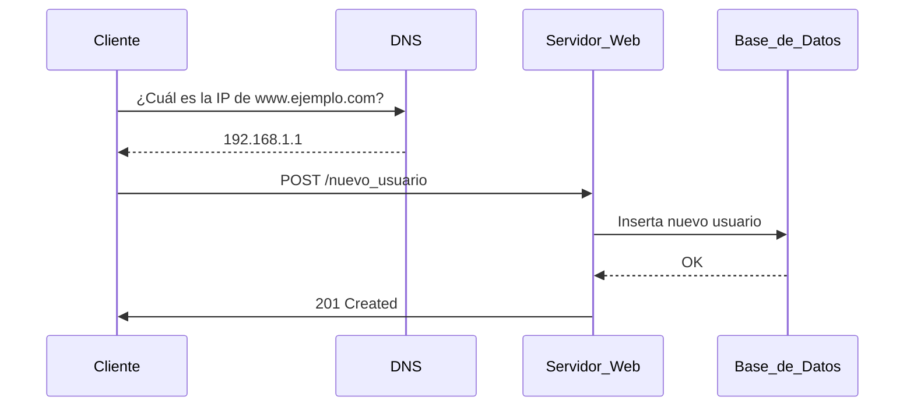
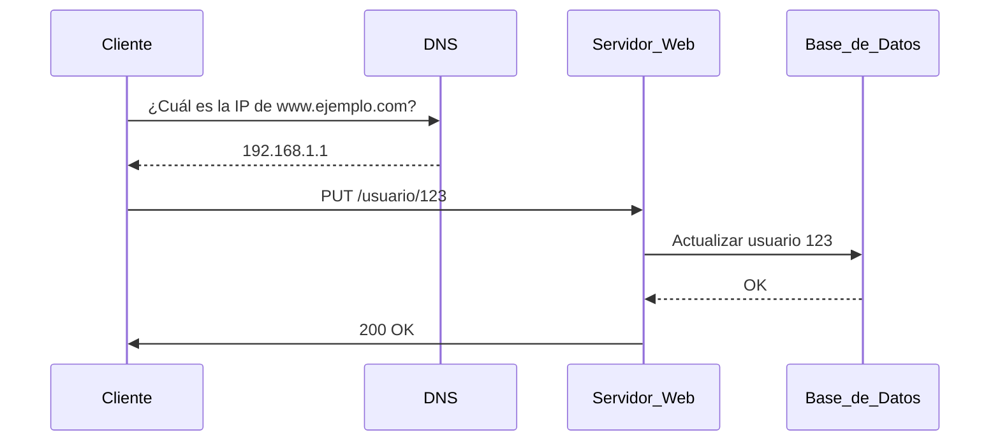
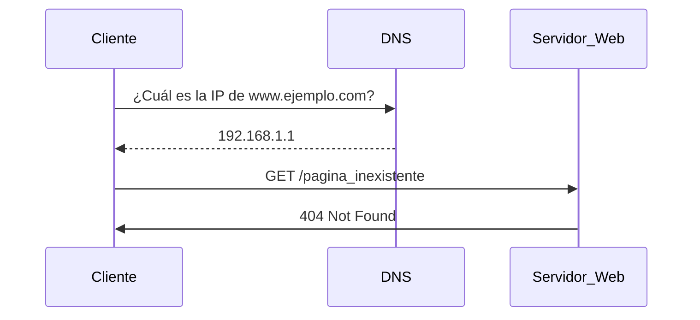
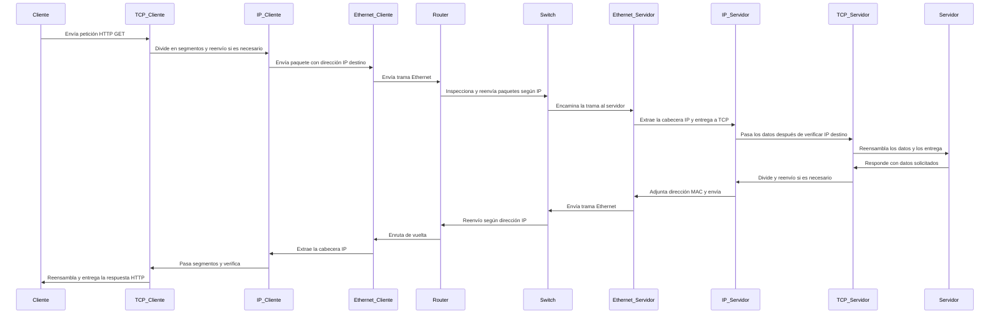

# 📡 Laboratorio de HTTP en Vivo - A nivel de red de aplicación.

## 📌 Introducción
Este laboratorio está diseñado para ayudar a los estudiantes a comprender el funcionamiento del protocolo HTTP mediante una simulación en vivo. Cada estudiante asumirá un rol dentro del ciclo de una petición HTTP, interactuando con otros compañeros para experimentar de primera mano cómo fluye la información en la web. Este enfoque permite una comprensión más clara de los conceptos fundamentales del protocolo, limitándonos **al nivel de aplicación dentro del modelo de capas TCP/IP**.

## 🎯 Objetivos
- Comprender el ciclo de vida de una petición HTTP.
- Identificar los diferentes roles involucrados en una comunicación HTTP.
- Diferenciar entre los métodos GET, POST y PUT.
- Experimentar con respuestas exitosas y con errores HTTP.

## 🎭 Roles
Cada estudiante asumirá uno de los siguientes roles:

1. **Cliente**: Usuario que realiza la solicitud a un servidor web.
2. **DNS**: Resuelve la URL a una dirección IP.
3. **Servidor Web**: Procesa la petición y devuelve una respuesta.
4. **Base de Datos**: Responde a consultas si es necesario.
5. **Firewall**: Filtra y bloquea peticiones según ciertas reglas.
6. **Cache**: Responde con datos almacenados si están disponibles.
7. **Logger**: Registra cada transacción HTTP.
8. **Error Handler**: Devuelve códigos de error en caso de fallo.

## 📊 Diagramas de Secuencia
### 🟢 Escenario 1: Petición GET
**Objetivo:** Obtener un recurso (ej. una página web). Se verifica si la información está en caché antes de consultar la base de datos.

### 🟡 Escenario 2: Petición POST
**Objetivo:** Enviar datos al servidor para crear un nuevo recurso (ej. registrar un usuario). La información se almacena en la base de datos.

### 🔵 Escenario 3: Petición PUT
**Objetivo:** Actualizar un recurso existente en el servidor (ej. modificar datos de un usuario). Se actualiza en la base de datos.

### 🔴 Escenario 4: Error 404
**Objetivo:** Simular un error cuando el recurso solicitado no existe. El servidor responde con un código 404 Not Found.

Cada uno de estos escenarios se puede representar en clase con estudiantes tomando los roles mencionados. Se pueden usar tarjetas con descripciones de cada rol y reglas específicas para cada caso.

Este laboratorio fomenta la participación activa y la comprensión práctica del protocolo HTTP.

---

# Laboratorio: Simulando una Petición HTTP a Nivel Físico

## Introducción

Este laboratorio está diseñado para que los estudiantes comprendan en profundidad cómo funciona una petición HTTP desde el nivel de aplicación hasta el nivel físico. Mediante una simulación en vivo, cada estudiante representará un rol específico dentro de la comunicación, actuando como cliente, servidor, routers, switches y demás elementos de la infraestructura de red.

En esta práctica, se representará una petición HTTP GET, analizando su descomposición en los diferentes niveles del modelo TCP/IP y simulando eventos reales como la pérdida de paquetes y su reenvío.

## Objetivos

1. Comprender el proceso de una petición HTTP GET desde la capa de aplicación hasta la capa física.
2. Identificar los diferentes protocolos y sus funciones en cada capa del modelo TCP/IP.
3. Observar el tráfico de red y los dispositivos involucrados en la transmisión de datos.
4. Simular la pérdida de paquetes y su reenvío en una comunicación fiable mediante TCP.
5. Fomentar la comprensión del trasiego de información entre distintos nodos de la red.

## Roles

Cada estudiante representará un rol específico dentro de la red:

- **Cliente HTTP:** Genera la petición GET y espera la respuesta.
- **Servidor HTTP:** Procesa la petición GET y responde con los datos solicitados.
- **Capa de Transporte (TCP):** Divide la información en segmentos y gestiona la retransmisión en caso de pérdida.
- **Capa de Red (IP):** Maneja la dirección de origen y destino de los paquetes.
- **Capa de Enlace de Datos (Ethernet):** Gestiona el direccionamiento MAC y la comunicación entre dispositivos de la misma red.
- **Router:** Inspecciona y reenvía paquetes según la dirección IP.
- **Switch:** Encamina tramas en base a direcciones MAC dentro de la misma red.
- **Canal Físico:** Representa la transmisión de datos a nivel eléctrico u óptico.

Se asignará un grupo de estudiantes a cada rol y se representará el flujo de datos mediante mensajes escritos o simbólicos.

## Diagrama de Secuencia (Mermaid)

Este laboratorio permite a los estudiantes experimentar en primera persona el recorrido de los datos y la importancia de cada capa en la transmisión de información.

