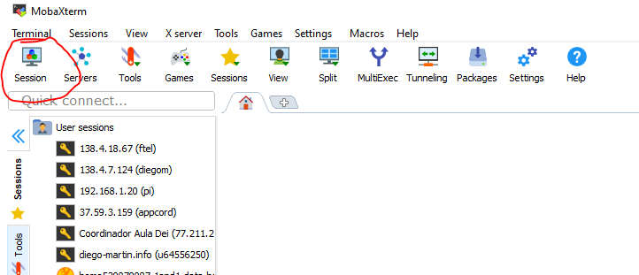
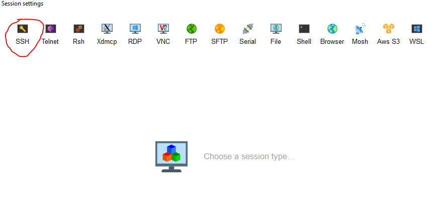
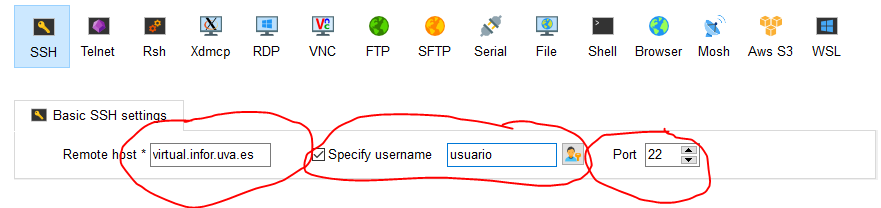

# FTI: 📘 Manual de Instalación de un Servicio Web en una Máquina Remota  

## 🔹 Introducción  

En este manual aprenderás a configurar y desplegar un servicio web en una máquina remota, utilizando herramientas esenciales como [SSH](https://es.wikipedia.org/wiki/Secure_Shell) y [MobaXterm](https://mobaxterm.mobatek.net/). Nuestro objetivo es proporcionarte una guía paso a paso que te permita:  

1️⃣ **Acceder a tu máquina virtual** mediante SSH y MobaXterm.  
2️⃣ **Crear una estructura de directorios** adecuada para alojar el servicio web.  
3️⃣ **Instalar y configurar un servidor web** basado en **Node.js** y **Express**.  
4️⃣ **Usar PM2** para gestionar la ejecución del servicio de forma eficiente.  
5️⃣ **Descargar el código del servidor** desde un repositorio de GitHub y ponerlo en marcha.  

Al finalizar este manual, serás capaz de gestionar un servidor web básico en una máquina virtual, lo que te servirá como base para futuros desarrollos y despliegues en entornos reales.


## ⚠️ **AVISO IMPORTANTE** ⚠️  

Las máquinas virtuales proporcionadas son exclusivamente para uso docente en la asignatura **Fundamentos de las Tecnologías de la Información (FTI)** o fines puramente docentes e instructivos.  

**Cualquier uso indebido o no autorizado será sancionado de manera inmediata con un suspenso automático en la asignatura, sin excepciones.**  

Además, **si se detecta un uso malintencionado o ilegal, se procederá a la denuncia correspondiente ante las autoridades académicas y, si es necesario, ante las autoridades legales competentes.**  

🔍 Los profesores monitorizamos activamente el uso de las máquinas virtuales, así como todo el equipo informático que hay detrás, para garantizar el correcto funcionamiento y la seguridad del servicio.

No hay advertencias ni segundas oportunidades. 

<p align="center"> ⚠️ 🔴 <strong><span style="font-size: 2em;">Usa estos recursos con responsabilidad</span></strong> 🔴 ⚠️ </p>

## 🌐 Servidor Virtual: Acceso y Configuración  

Cada estudiante dispone de una **máquina virtual** (VM) preconfigurada con los recursos necesarios para alojar su servicio web. Estas máquinas están accesibles a través de Internet y permiten tanto la gestión remota mediante [SSH](https://es.wikipedia.org/wiki/Secure_Shell) como la visualización del servicio web desde un navegador.  

## 📡 Conexión a la Máquina Virtual  

Para acceder a tu máquina virtual (**VM**), necesitas utilizar **[SSH](https://es.wikipedia.org/wiki/Secure_Shell)** o un programa con interfaz gráfica para gestionar conexiones **SSH**. Recomendamos [MobaXterm](https://mobaxterm.mobatek.net/) por su facilidad de uso, versatilidad y compatibilidad con todos los sistemas operativos.  

### 🔑 Información de conexión  

Para conectarte a la VM, necesitarás los datos de acceso que te han sido proporcionados por correo electrónico:  

- **🌍 Dirección URL** → Se usa tanto para la conexión **SSH** como para acceder al servicio web vía **HTTP**.  
- **🔐 Puerto SSH** → Necesario para establecer una conexión segura con la VM.  
- **🌐 Puerto HTTP** → Permite visualizar el servicio web desde un navegador.  
- **👤 Usuario** → Nombre de usuario asignado para la conexión.  
- **🔑 Contraseña** → Clave de acceso a la máquina virtual.  

⚠️ **Importante**:  
1. Si no tienes esta información, contacta con tu profesor para que te la proporcione.  
2. **No confundas el puerto SSH con el puerto HTTP**:  
   - **SSH** se usa para conectarte a la consola de la VM y administrar el sistema.  
   - **HTTP** es para acceder al servicio web alojado en la VM desde un navegador.  

### 🔑 Conexión mediante SSH  

Podemos conectarnos a la máquina virtual mediante SSH ya sea por línea de comando usando **SSH** o usando un programa como **MobaXterm**. Vamos primero a ver cómo hacerlo por línea de comando y después explicaremos hacerlo con **MobaXterm** que es la propuesta recomendada.

#### 1️⃣ Conexión por Línea de Comandos

En **Linux/macOS**, no necesitas instalar nada, ya que [SSH](https://www.ssh.com/academy/ssh) viene preinstalado.  
En **Windows**, puedes usar [Git Bash](https://git-scm.com/downloads), que incluye SSH, aunque es probable que ya lo tengas instalado.

🔹 **Paso 1: Abrir la terminal**  
En Linux/macOS, usa **Terminal**.  
En Windows, abre **Git Bash** o la **Consola de Windows (cmd/PowerShell)**.

🔹 **Paso 2: Conectarte a la máquina virtual**  
Ejecuta el siguiente comando, reemplazando los valores según tu configuración:

```sh
ssh -p PUERTO_SSH usuario@virtual.infor.uva.es 
```

📌 **Parámetros a modificar**:  
- **PUERTO_SSH**: Número de puerto para la conexión SSH.  
- **usuario**: Tu nombre de usuario asignado.

### 🔐 Primera conexión: aceptar la clave del servidor  
Si es la primera vez que te conectas, SSH te pedirá que confirmes la autenticidad del servidor con un mensaje similar a:

```
Are you sure you want to continue connecting (yes/no/[fingerprint])?
```

✅ Escribe `yes` y presiona `Enter`.


### 🔑 Introducir la contraseña  
- Después, se te pedirá la contraseña la contraseña es `cambialaclaveya`
- Escríbela y presiona `Enter`.

⚠ **IMPORTANTE:**  
- No verás asteriscos ni caracteres al escribir la contraseña.  
- Esto es completamente normal en SSH.  
- Solo escribe tu contraseña y presiona `Enter`.  
- No olvides cambiar tu contraseña en cuanto te conectes!! Para ello debes usar el comando `passwd` y seguir las instrucciones. Debes elegir una contraseña robusta, segura y no repetida. 
- Si alguien entra en su servidor y hace algo malintencionado, la responsabilidad recaerá sobre ti.

Si tienes una respuesta por consola con la siguiente aspecto:

```sh   
Last login: Tue Feb 11 10:38:10 2025 from 157.88.80.82
usuario@labFTI-10:~$ 
```

¡Felicidades! ¡Ya estás conectado a tu máquina virtual! 🎉

### 2️⃣ Conexión con MobaXterm

[MobaXterm](https://mobaxterm.mobatek.net/) es una herramienta para todos los sistemas operativos que facilita la conexión remota mediante **SSH** con una interfaz gráfica avanzada.

🔹 **Paso 1: Descargar e instalar MobaXterm**  
Si aún no lo tienes instalado, descarga la versión **Home Edition** desde su [página oficial](https://mobaxterm.mobatek.net/download.html) y además proponemos descargar, siempre que se pueda, la versión portable, ya que la podemos instalar en un pendrive.

🔹 **Paso 2: Abrir MobaXterm**  
Ejecuta **MobaXterm** y accede a la pantalla principal.

🔹 **Paso 3: Crear una nueva sesión SSH**  
1. Haz clic en **Session** (sesión) en la parte superior izquierda.  

<div align="center">
    
</div>

2. Selecciona **SSH**.  
<div align="center">
    
</div>

3. En **Remote host**, introduce la dirección de la máquina virtual:  
   ```
   virtual.infor.uva.es
   ```
3. En **Specify username**, introduce tu usuario asignado.  
4. En **Port**, introduce el **PUERTO_SSH** correspondiente.  

<div align="center">
    
</div>

5. Haz clic en **OK** para guardar y conectar.

### 🔐 Primera conexión: aceptar la clave del servidor  [No siempre ocurre este paso.]
Si es la primera vez que te conectas, MobaXterm te pedirá que confirmes la autenticidad del servidor con un mensaje similar a:

```
Host key verification failed. Do you want to continue? (Yes/No)
```

✅ Selecciona **Yes** para continuar.

### 🔑 Introducir la contraseña  
Cuando se solicite, introduce tu contraseña y presiona `Enter`.  (La primera contraseña es `cambialaclaveya`, pero debes cambiarla en cuanto te conectes)
⚠ **Recuerda:** No se mostrarán caracteres mientras la escribes, pero se está registrando.


Te pedirá si quieres salvar tu contraseña para acceder al servicio, es buena idea tenerla guardada para no tener que reescribirla constantemente. Pero si eres un freak de la seguridad, no lo hagas.


Si ves un mensaje como este en la terminal integrada de MobaXterm:

```sh
     ┌────────────────────────────────────────────────────────────────────┐
     │                        • MobaXterm 25.0 •                          │
     │            (SSH client, X-server and networking tools)             │
     │                                                                    │
     │ ➤ SSH session to usuario@vpn.infor.uva.es                         │
     │   • SSH compression : ✔                                            │
     │   • SSH-browser     : ✔                                            │
     │   • X11-forwarding  : ✔  (remote display is forwarded through SSH) │
     │   • DISPLAY         : ✔  (automatically set on remote server)      │
     │                                                                    │
     │ ➤ For more info, ctrl+click on help or visit our website           │
     └────────────────────────────────────────────────────────────────────┘

[Muchos datos de la conexión]


Last login: Tue Feb 11 10:38:10 2025 from 157.88.80.82
usuario@labFTI-10:~$
```

¡Felicidades! 🎉 Ya estás conectado a tu máquina virtual.

Como podrás comprobar tienes un panel a la izquierda que te permite subir y bajar archivos, lo cual es muy util e interesante cuando estamos trabajando con servidores remotos.

Aquí tienes el inicio del manual en Markdown:  


# 🐧 Comandos básicos de Linux

En este apartado, vamos a ver los comandos esenciales de Linux que necesitaremos para instalar y desplegar nuestro servidor web. Si quieres profundizar más, puedes consultar [este manual completo de comandos Linux](https://linuxcommand.org/).

## 📂 Gestión de directorios y archivos  

- `ls` – Lista los archivos y directorios en la ubicación actual.  
  ```bash
  ls -l
  ```
- `cd <directorio>` – Cambia al directorio especificado.  
  ```bash
  cd /home/usuario/proyecto
  ```
- `mkdir <nombre>` – Crea un nuevo directorio.  
  ```bash
  mkdir mi_carpeta
  ```
- `rm <archivo>` – Elimina un archivo.  
  ```bash
  rm archivo.txt
  ```
- `rm -r <directorio>` – Borra un directorio y su contenido.  
  ```bash
  rm -r mi_carpeta
  ```
- `cp <origen> <destino>` – Copia archivos o directorios.  
  ```bash
  cp archivo.txt copia.txt
  ```
- `mv <origen> <destino>` – Mueve o renombra archivos.  
  ```bash
  mv archivo.txt nuevo_nombre.txt
  ```

## 🌐 Conexión y redes  

- `ping <host>` – Comprueba la conectividad con otro equipo.  
  ```bash
  ping google.com
  ```
- `curl <URL>` – Realiza peticiones a una URL.  
  ```bash
  curl https://example.com
  ```
- `wget <URL>` – Descarga un archivo desde una URL.  
  ```bash
  wget https://ejemplo.com/archivo.zip
  ```


# 📌 Instalación de Node.js, NPM y PM2  

En este apartado explicaremos cómo instalar y utilizar **Node.js**, **NPM** y **PM2** en una máquina remota para desplegar un servicio web de manera eficiente y persistente.

## 🔹 ¿Qué es Node.js?  
[Node.js](https://nodejs.org/) es un entorno de ejecución para JavaScript del lado del servidor basado en el motor V8 de Chrome. Permite ejecutar código JavaScript fuera del navegador, lo que lo hace ideal para construir aplicaciones web escalables y rápidas.  

Lo utilizaremos para ejecutar nuestro servidor web basado en **Express.js**.

## 🔹 ¿Qué es NPM?  
[NPM (Node Package Manager)](https://www.npmjs.com/) es el gestor de paquetes de Node.js. Nos permite instalar librerías y herramientas necesarias para nuestro proyecto.  

Lo usaremos para instalar las dependencias de nuestro servidor web.

## 🔹 ¿Qué es PM2?  
[PM2](https://pm2.keymetrics.io/) es un gestor de procesos para Node.js que nos permite ejecutar, monitorear y mantener en ejecución nuestras aplicaciones incluso después de un reinicio del sistema.  

Las aplicaciones se caen, hay errores, excepciones, ¿que te voy a contar no?

Para que el servicio esté ejecutado a pesar de estas interrupciones. Emplearemos PM2 para asegurarnos de que nuestro servidor web siga activo en segundo plano.

---

## 🛠 Instalación de Node.js y NPM  
### 📌 Verificando si ya está instalado  
Antes de instalar, revisemos si **Node.js** y **NPM** están disponibles en nuestro sistema:  

```sh
node -v
npm -v
```

Si estos comandos devuelven un número de versión, significa que ya están instalados.

### 📌 Instalación en Ubuntu  
Ejecutamos los siguientes comandos para instalar la última versión estable de Node.js y NPM. Seguramente te pida confirmación de la **password**.

```sh
curl -fsSL https://deb.nodesource.com/setup_18.x | sudo -E bash -
sudo apt install -y nodejs
```

Verificamos la instalación nuevamente:

```sh
node -v
npm -v
```

---

## 🛠 Instalación de PM2  
Una vez instalado Node.js y NPM, podemos instalar **PM2** con el siguiente comando usando NPM:

```sh
sudo npm install -g pm2
```

Verificamos que PM2 está correctamente instalado con:

```sh
pm2 -v
```

Con esto, ya tenemos un entorno listo para ejecutar nuestro servicio web de forma persistente. 🚀

# 🌍 Instalación del **Servidor Web FTI**  

En esta sección explicaremos la instalación de un servidor web ligero para servir archivos estáticos y su mantenimiento.  

## 📌 Características  

- 📂 Sirve archivos solo desde `html/` y sus subdirectorios (`css/`, `js/`, `img/`).  Por defecto, está el laboratorio 3 de CSS.
- 📡 Registra cada conexión en la consola.  
- 🚀 Fácil de ejecutar y configurar.  
- 🔄 Se mantiene en ejecución con [PM2](https://pm2.keymetrics.io/) para mayor estabilidad.  

## 🛠️ Instalación  

### 1️⃣ Clonar el repositorio  
Para obtener el código fuente, ejecuta:  

```sh
git clone https://github.com/DiegoMartindeAndres/servidor-FTI
```

Con esto, estás clonando el repositorio del servidor web FTI en tu máquina remota para poder empezar a trabajar con él.

### 2️⃣ Acceder al directorio del proyecto  
```sh
cd servidor-FTI/
```

### 3️⃣ Instalar dependencias  
El servidor utiliza Node.js y Express. Instala todas las dependencias ejecutando:  

```sh
npm install
```

### 4️⃣ Configurar PM2 (Opcional pero Recomendado)  
Vamos a usar PM2 para mantener nuestro servidor en ejecución, incluso después de cerrar la conexión [SSH](https://www.ssh.com/academy/ssh). Para iniciar el servidor con PM2, ejecuta:  

```sh
pm2 start index.js --name servidor-FTI
```

Este comando inicia el servidor y lo nombra como `servidor-FTI` para una fácil identificación.

Para ver los servidores en ejecución, usa:

```sh
pm2 list
```

Se te mostrará una tabla con los servidores en ejecución y su estado. Si está vacía significa que no tendrás nada en ejecución.

Para asegurarte de que se inicie automáticamente tras un reinicio del sistema:  

```sh
pm2 startup
pm2 save
```

### 🔴 Apagar un servicio en PM2  
Si en algún momento necesitas detener el servidor, puedes hacerlo con:

```sh
pm2 stop servidor-FTI
```

Si deseas eliminarlo completamente de la lista de procesos de PM2:

```sh
pm2 delete servidor-FTI
```

Esto asegurará que el servicio no se reinicie automáticamente después de un reinicio del sistema.

### 5️⃣ Iniciar el servidor manualmente  
Si no usas PM2, puedes ejecutar el servidor directamente con:  

```sh
node index.js
```

Esta opción está bien para hacer pruebas, pero recuerda que si cierras la conexión SSH, el servidor se detendrá.

## 📁 Estructura del Proyecto  

```
servidor-FTI/
│── index.js          # Archivo principal del servidor
│── package.json      # Configuración del proyecto
│── html/             # Carpeta pública
│   │── index.html    # Página principal
│   │── css/          # Hojas de estilo
│   │── js/           # Scripts
│   │── img/          # Imágenes
```

## 🌐 Acceso al Servidor  

Una vez en ejecución, el servidor estará disponible en:  

```
http://virtual.infor.uva.es:PUERTO_HTTP/
```


🎉 ¡El Último Paso hacia la Gloria! 🎉

🔹 No olvides reemplazar PUERTO_HTTP por el puerto que te ha sido concedido.

Ha llegado el momento de la verdad. Abre tu navegador y accede a la URL correspondiente.

Si en tu pantalla aparece tu web funcionando a la perfección...

🌟 ¡ENHORABUENA! Has conquistado este manual con éxito. 🌟

🚀 ¡Ahora eres el maestro de tu propio servidor web! 


<div align="center">
    
</div>


## 🔧 Personalización  

Puedes agregar más archivos dentro de `html/` y sus subdirectorios (`css/`, `js/`, `img/`), y el servidor los servirá automáticamente.  


## 📜 Licencia  

Este proyecto está bajo la licencia [MIT](LICENSE).  
